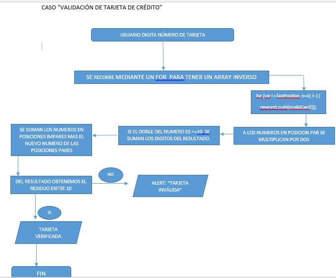

El usuario ingresa el numero de tarjeta de credito a validar
mediante un for recorremos el array y creamos una variable con el array inverso
los numeros en posiciones pares los multiplicamos por dos
según la condición, si el doble del numero es mayor o igual a 10 sse suman los digitos del resultado
si no se cumple, el numero no se modifica
se suman los numeros de posiciones impares y el de posiciones pares
al resultado le aplicamos residuo y se divide entre 10
si el resultado es mayor o igual a 10 "tarjeta valida"
de lo contrario la tarjeta es invalida.
fin del proceso
